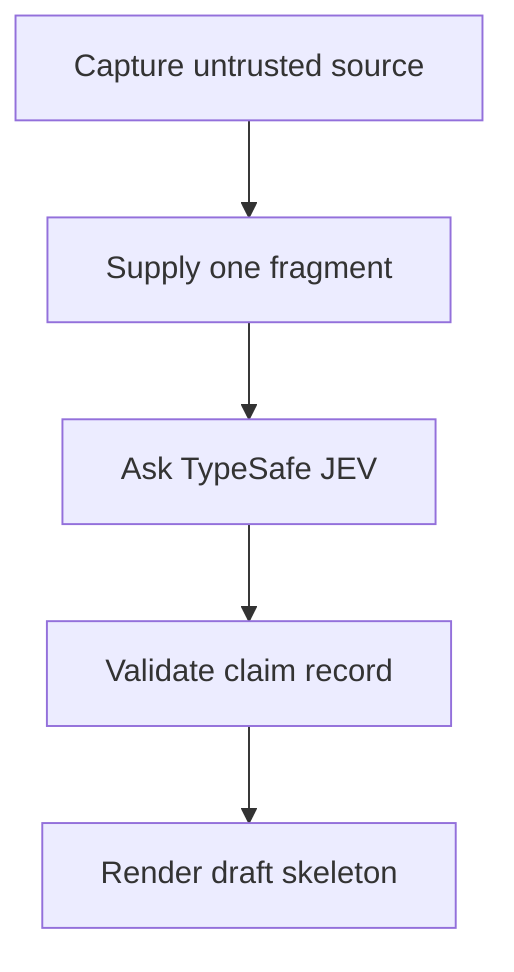

# jev-classifier

A researcher comparing AI-written accounts of a paper needs to know which source supports each claim and when that record changed. jev-classifier is a prototype for turning a supplied research fragment into a structured, reviewable claim record.

## Why this exists

A literature review can repeat the same claim in several transcripts while hiding whether those accounts rely on the same paper, whether their wording changed, or whether one source disagrees. **Every claim needs a trail.** This project is meant to make the claim, evidence pointer, model judgment, and record time easier to inspect together.

Today the repository can classify a single supplied fragment. Its two-fragment example uses invented study excerpts and mocked JEV answers; it shows the shape of the workflow, not a result about real research. The gap between that small prototype and reliable paper-level synthesis is explicit.

## What this project is

This is a model-role-separated research classifier prototype for researchers and maintainers who want structured claim records and a traceable draft. Python handles parsing, validation, aggregation, timestamps, and rendering. Only TypeSafe JEV may supply semantic classifier judgments. Source-generating models may supply untrusted transcripts; their text is not a label or scientific ground truth.

The current source adapter uses Grok through OpenRouter. Model-agnostic source adapters and richer cross-source synthesis remain goals, not shipped capabilities. The role image is a visual explanation of the boundary, not evidence that capture and classification are already joined automatically.

## What you can make or use

| Output or workflow | Current status |
| --- | --- |
| A versioned, bounded source transcript with citation annotations and a content hash | Shipped in code; one capped live smoke returned HTTP 404, with no retry or live artifact, so provider availability remains unverified. [Source module](https://github.com/Pukujan/jev-classifier/blob/f9ffdf018a03d9af4272fec688546de582afe196/src/jev_classifier/sources/grok.py) · [Recorded smoke result](https://github.com/Pukujan/jev-classifier/issues/15#issuecomment-5849375676) |
| A typed claim record for one fragment using a closed JEV choice | Shipped for the single-fragment path. [Classifier](https://github.com/Pukujan/jev-classifier/blob/f9ffdf018a03d9af4272fec688546de582afe196/src/jev_classifier/classify.py) |
| Validated choice and yes/no answers | Shipped; score normalization is not implemented. [Normalizer](https://github.com/Pukujan/jev-classifier/blob/f9ffdf018a03d9af4272fec688546de582afe196/src/jev_classifier/normalize.py) · [open gap #32](https://github.com/Pukujan/jev-classifier/issues/32) |
| A six-section Markdown paper draft from supplied claim records | Shipped as a deterministic skeleton, not a research synthesis. [Assembler](https://github.com/Pukujan/jev-classifier/blob/f9ffdf018a03d9af4272fec688546de582afe196/src/jev_classifier/paper/assemble.py) |
| Small offline claim-type and contradiction fixtures | Shipped as deterministic, hand-authored synthetic examples modeled on label shapes; no upstream corpus text or benchmark result is included. [Dataset card](https://github.com/Pukujan/jev-classifier/blob/122e4742b260c8e63fc35b2916adb8eb6dfd1e96/docs/DATASETS.md) · [Generator](https://github.com/Pukujan/jev-classifier/blob/122e4742b260c8e63fc35b2916adb8eb6dfd1e96/scripts/generate_synthetic_fixtures.py) |
| A two-fragment example | Experimentally supported only by synthetic text and mocked JEV answers. [Test](https://github.com/Pukujan/jev-classifier/blob/f9ffdf018a03d9af4272fec688546de582afe196/tests/test_multisource_e2e.py) |
| Paper-level quality targets | Planned under [issue #21](https://github.com/Pukujan/jev-classifier/issues/21); no holdout score is reported. |

## How it works

1. A source adapter can capture a bounded research response. The captured words and citations remain untrusted input.
2. A caller supplies one fragment, its allowed labels, and a short description for every label.
3. The classifier sends that fragment to the OpenRouter Decisions endpoint configured for TypeSafe JEV. The normalizer rejects malformed or out-of-set answers instead of inventing a label.
4. Python records the returned label, epistemic status, evidence pointer, model field, probability map when present, and transaction time. Optional valid-time fields are separate, but timestamp order and evidence-reference existence are not checked yet.
5. The assembler renders supplied records into Title, Abstract, Claims, Provenance, Lineage, and Citations sections. It does not write a narrative synthesis or establish that citations support claims.

## Evidence and boundaries

A field being present is not a guarantee about the evidence behind it. A citation makes a claim traceable; it does not make the claim true.

- The JEV-only classifier rule is a project boundary, but returned model identity is not yet checked against the request on every path. See the [fragment classifier](https://github.com/Pukujan/jev-classifier/blob/f9ffdf018a03d9af4272fec688546de582afe196/src/jev_classifier/classify.py) and [Decisions client](https://github.com/Pukujan/jev-classifier/blob/f9ffdf018a03d9af4272fec688546de582afe196/src/jev_classifier/decisions.py).
- The ontology is a small OWL2 vocabulary; tests parse its Turtle, but there is no SHACL validator or full OWL reasoner. See the [ontology](https://github.com/Pukujan/jev-classifier/blob/f9ffdf018a03d9af4272fec688546de582afe196/ontology/jev_classifier_claims.ttl).
- Current bias checks are structured signals from closed JEV questions. They are not a validated detector of model or agent bias.
- Real-paper claim fidelity, the hidden holdout, ten-paper reverse analysis, and 30 development iterations are planned in [issue #21](https://github.com/Pukujan/jev-classifier/issues/21). The requested 0.80 claim-level F1 is a target, not a measured result.
- The longer [system specification](docs/SYSTEM_SPEC.md) describes additional implementation gaps. Its technical contract remains owned by its issue.

## Image generation and use

The images are explanatory editorial illustrations. Their exact visible copy, generation notes, dimensions, alt text, crop guidance, review decision, and hashes are in [the image guide](docs/IMAGE_GUIDE.md), [the asset notes](assets/marketing/IMAGE_NOTES.md), and [.content-system/asset-manifest.json](.content-system/asset-manifest.json). The saved prompts were reconstructed from the delivered assets; they are labeled as prompt intent, not presented as verbatim original prompts.

## Templates and guides

- [Project brief and evidence records](.content-system/project-brief.json)
- [README writing playbook](docs/README_PLAYBOOK.md)
- [README generation and validation entry points](docs/README_GENERATION.md)
- [Project research notes](docs/CONTENT_RESEARCH.md)
- [Brand direction](docs/BRAND_DIRECTION.md)
- [Image generation and reuse](docs/IMAGE_GUIDE.md)
- [Evidence and holdout plan](docs/HOLDOUT_EVALUATION.md)
- [Synthetic dataset fixtures and licensing](docs/DATASETS.md)
- [README quality: product definition](docs/README_QUALITY_PDD.md), [system design](docs/README_QUALITY_SDD.md), and [test design](docs/README_QUALITY_TDD.md)
- [Provenance and citations](docs/PROVENANCE_AND_CITATION.md)
- [Reverse analysis of PCM and adopter examples](docs/REVERSE_ANALYSIS_PCM_AND_ADOPTERS.md)
- [Migration notes for CGM 0.2](docs/MIGRATING_TO_0.2.md), [0.3](docs/MIGRATING_TO_0.3.md), and [0.4](docs/MIGRATING_TO_0.4.md)
- [README starter](templates/README.template.md)
- [Current project status](docs/CURRENT.md), [technical module contracts](docs/SYSTEM_SPEC.md), and [owner authority](docs/AUTHORITY.md)

## Prior work and references

This project reuses the [Project Continuity Modules](https://github.com/Pukujan/project-continuity-modules) as a helper for continuity and evidence-led records; PCM is not the classifier's authority or a runtime dependency. The [PROV-O model](https://www.w3.org/TR/prov-o/) is a reference for representing entities, activities, agents, and derivation, while the project's actual vocabulary and validation scope are narrower.

The repository's [Grok source-capture work](https://github.com/Pukujan/jev-classifier/issues/15), [JEV and provenance specification](docs/SYSTEM_SPEC.md), and [quality-program issue](https://github.com/Pukujan/jev-classifier/issues/21) are the direct project history. Reuse the evidence boundary, not an assumption that future synthesis is already complete.

## Try it

From a Python 3.11 or newer environment, install the project and run its offline tests:

    python -m pip install -e ".[dev]"
    python -m pytest tests/ -q

For one opt-in live JEV check, set OPENROUTER_API_KEY in the environment or ignored project .env, then run:

    python scripts/smoke_jev.py

This smoke test makes a live provider request. Source collection has a separate command and its bounded behavior is described in [GROK_SOURCE.md](docs/GROK_SOURCE.md). The first useful review step is to open [the synthetic fragment](tests/fixtures/multisource/fragment_method_a.json) and trace it through the [multi-source test](tests/test_multisource_e2e.py).

## Build and reproduce

See [the project notes](PROJECT.md), [the system specification](docs/SYSTEM_SPEC.md), and [the source-capture instructions](docs/GROK_SOURCE.md). The planned paper-level evaluation is tracked in [issue #21](https://github.com/Pukujan/jev-classifier/issues/21).
