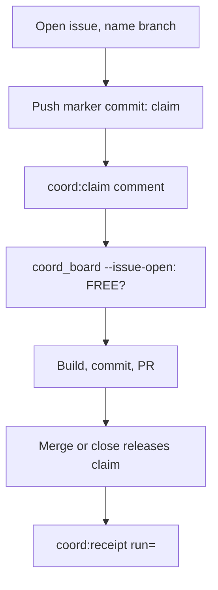

# Proposal, claim, and receipt protocol (mechanics)

This document specifies the **machine mechanics** of coordinating multiple
agents in this repository. The policy — who holds authority and what never
stops — lives in [`AUTHORITY.md`](AUTHORITY.md) and is not restated here.
Issue-level ratifications and adjudications recorded before this grammar
existed (e.g. the `## Decision — ACCEPT` comments on #14/#18/#22) remain
valid prose rulings; new rulings should carry the markers below so tools can
read them.

## Why these mechanics exist

Every agent pushes from one shared GitHub account (`Pukujan`), and the local
SQLite stores (`.coord/`, `.ops/`) are gitignored per-device files. A claim
recorded only in SQLite can never collide across machines, so two agents
could build the same task and only discover it at PR time. The protocol moves
the lock to things that **are** shared and atomic:

1. **The reserved branch.** GitHub create-ref is atomic server-side: the
   first agent to push `feat/<slug>-<issue#>` owns it; the second push is
   rejected. This is the real cross-device mutex.
2. **Comment markers.** `coord:*` HTML comments on issues are durable,
   fetchable, and append-only. They record claims, proposals, verdicts, and
   run receipts in a form tools can parse.

## Identity: `agent_id` is per-session, not per-account

`agent=` and `by=` are **self-declared** under a shared login: they are
evidence, not enforcement. Two sessions must never share one id — the #22
collision (arbiter self-verdict vs. flagger-held branch) came from two
sessions both writing `claude-code-main`.

- Format: `<role-or-tool>@<device-or-session>`, e.g.
  `coordination-flagger@macbook`, `codex@cloud-2`, `claude-code-main@mbp14`.
- The **roster** in `AUTHORITATIVE_AGENTS`
  (`src/jev_classifier/coord/records.py`) lists **roles**: a verdict from
  `by=claude-code-main@mbp14` is authoritative because its role part matches
  the roster (an exact full-id entry also pins one machine). Non-roster
  `by=` ⇒ advisory. Update the roster only via an owner-endorsed change to
  [`AUTHORITY.md`](AUTHORITY.md).
- **Claim matching** is session-tolerant but not session-blind:
  a bare `coordination-flagger` claim matches a `--agent
  coordination-flagger@macbook` query (same role), but two ids that both
  carry **different** `@device` suffixes never match — that ambiguity is
  exactly what caused the #22 double-`claude-code-main` collision.
- A **role** (`claude-code-main` = the arbiter) and a **session id** are
  different things; when the arbiter rules, it declares its full session id
  in `by=`.

## The claim protocol (work locks)

> Terminology: a `coord:claim` is a **work lock on a GitHub issue**. It is
> unrelated to the epistemic claim records in
> [`CLAIM_SCHEMA.md`](CLAIM_SCHEMA.md) (paper claims with valid/recorded
> time). Same word, different layer.

1. **Reserve the branch in the issue.** The owning issue's body names its
   branch: `feat/<slug>-<issue-number>`. The trailing issue number is
   mandatory — tools read it back (`ref_issue_number`).
2. **Claim-marker push first.** Before writing product code, push the
   reserved branch containing only a marker commit (empty commit is fine).
   If the push is rejected because the ref exists, someone else holds the
   issue: stop, comment on the issue, take other work.
3. **Post the claim record** on the issue:

   ```markdown
   <!-- coord:claim issue=22 agent=coordination-flagger@mbp14
        branch=feat/coordination-layer-22 sha=67eaa8b state=active -->
   ## Claim — <one-line scope>
   ```

   Required fields: `issue`, `agent`, `branch` (a claim without a reserved
   ref is not a lock and the parser rejects it), `sha` (may start as
   `pending`, edit the comment to fill in — last-writer-wins per
   `(issue, agent)`), `state` (`active` | `released`).
4. **Gate before work.**
   `python scripts/coord_board.py --issue-open <n> --agent <you>` must print
   `FREE` or `CLAIMED-BY-YOU` before your first product commit. Exit codes:
   0 = go, 3 = blocked (claimed / claimed-by-ref / **CLOSED issue** — never
   rebuild delivered work; file a follow-up leaf instead).
5. **Release is automatic.** A claim stops holding when its reserved branch
   merges (PR `merged_at` — this repo squash-merges, so branch ancestry
   alone would miss it) **or** its issue closes (GitHub state). The board
   marks such rows `released_by=merged_pr|closed_issue` and drops them from
   Live claims. For a handoff without merge/close, edit the claim comment to
   `state=released`.

## Proposals and verdicts

A **proposal** argues a design direction; a **verdict** adjudicates it.
Post them as issue comments; the marker is the first line:

```markdown
<!-- coord:proposal id=P-22-1 author=agent-session-id issue=22
     status=open scope=coordination depends=none -->
## Proposal P-22-1: <problem-first title>

**Problem / Proposal (proposal) / Cost / Risk / Alternative considered** —
core-tier prose per docs/ISSUE_LOG_FORMAT guidance. None of it exists
unless named as existing.
```

```markdown
<!-- coord:verdict on=P-22-1 by=arbiter-session-id decision=accepted -->
**Reason** and **Conditions** in the comment body.
```

Grammar rules the parser enforces (`records.py`):

- `decision` ∈ accepted/rejected/superseded/deferred. `ACCEPT`, `ACCEPT-DECOMPOSE`,
  `ACCEPT-DEFERRED` fold by prefix; the raw token is preserved as
  `decision_raw`.
- Target may be given as `on=<proposal-id>`, `proposal=<id>`, or `issue=<n>`.
  `issue=<n>` is an **issue-level ratification**: it keys as `issue:<n>`, can
  never overwrite a proposal-targeted verdict, and counts as a decision for
  every `coord:proposal` whose `issue=` matches — the shape used by the live
  arbiter on #22 before `coord:proposal` existed.
- `by=` outside the roster ⇒ **advisory**: displayed on the board, never
  applied; a later advisory verdict cannot void an accepted one (separate
  fold slot).
- Only the authoritative agent writes `accepted/rejected/superseded/deferred`
  statuses; a proposer may set `status=open` or edit to `withdrawn` only.
- **SLA:** adjudicate within 24 h of the oldest open proposal; past that a
  proposer may proceed on non-conflicting parts and ping once. A late
  verdict overrides what was built: affected work re-plans, cost recorded.

## Run receipts (owner telemetry direction, #22)

Append-only durable evidence that a run happened and what it produced —
one marker per run, never edited after the fact (corrections are new
receipts referencing the old `run=`). Keep the whole marker on **one line**
(unquoted values stop at whitespace):

```markdown
<!-- coord:receipt run=2026-09-26T19-r1 task=JEV-0002 pr=29 commit=abc1234 outcome=merged started=2026-09-26T19:00Z finished=2026-09-26T19:40Z agent_alias=A-7f3c model_alias=M-91ab model_version_alias=V-04ef temperature=unavailable tools="gh,pytest x4" provenance="outcome:runtime_observed;commit:runtime_observed;agent_alias:owner_recorded;model_alias:owner_recorded;temperature:unavailable;tools:agent_declared" -->
**Evidence:** PR #29 checks; run log hash `sha256:1a2b…` (artifact, not inline).
```

- `run` (stable unique id) and `outcome` are required; everything else is
  optional but must state provenance honestly.
- **Per-field provenance** is validated in form:
  `provenance="field:source;field:source"` (a single token without `:` is a
  blanket default). Sources are exactly `runtime_observed` |
  `provider_returned` | `agent_declared` | `owner_recorded` | `unavailable`;
  any other token fails the parser (fail-closed — an unlabeled field must
  not slip through). Fields with no token render as `unavailable`, never
  guessed from defaults. Never infer a temperature or claim a tool run
  without evidence.
- **Aliases:** `agent_alias`/`model_alias`/`model_version_alias` are opaque
  and stable per owner assignment. The alias→identity map lives in an
  owner-controlled vault **outside** GitHub, this repo, CI, `.env`, and every
  model/agent-visible process; if backed up, encrypt to an owner-held key
  (RFC 9180 HPKE-style envelope) — never a decryption path reachable by an
  agent, and never a short numeric code shared in chat. Reports and
  benchmark scores stay **blinded by alias** until the owner resolves the
  map.
- Receipts carry minimized metadata + evidence links only: no secrets, no
  raw prompts, no private user data, no tool payloads.

## The board and the gate

- **One committed board:** `ops/ledger/COORD.md`, regenerated **only by
  live syncs** (`python scripts/ops_sync.py`, gh mode) from GitHub comments.
  Fixture/offline runs never touch it (idempotency and no-clobber are tested
  against temp ledger dirs in `tests/test_ops_coord_board.py`). It is a
  projection — GitHub comments remain the record.
- **Point-query gate:** `python scripts/coord_board.py` — readable board;
  `--issue-open N --agent <you>` (0 go / 3 blocked, incl. CLOSED issues);
  `--proposal P-x --can-build` (3 unless authoritatively accepted);
  `--json` for tooling. Offline mode: `--comments-file <json array>`.



Text alternative: 1) issue reserves `feat/<slug>-<n>`; 2) marker-commit push
claims the ref (second push rejected = second agent blocked); 3) post
`coord:claim`; 4) gate must say FREE/CLAIMED-BY-YOU before product commits;
5) small PR from the branch; 6) merged PR or closed issue auto-releases the
claim; 7) post a `coord:receipt` with run/outcome.

## Anti-patterns

- Claiming only in SQLite (`CoordStore`) and skipping the marker push —
  invisible across devices.
- Posting a `coord:verdict` whose `by=` role you do not hold.
- Branch names without the issue number (tools cannot join ref→issue).
- Editing a merged/delivered receipt instead of appending a correcting one.
- Treating `ops/ledger/COORD.md` as authority; it is a projection.

## Verify

```bash
python -m pytest tests/test_coord_board.py tests/test_ops_coord_board.py -v
python scripts/coord_board.py --issue-open 22 --agent <you>
```

## Messages (A2A, #61 Stage 1)

Operational chatter between agents rides on `coord:message` markers — requests,
handoffs, status pings, answers, conflict reports, and acks. The full verdict
ruling lives on #61 (comment 5851128354).

```markdown
<!-- coord:message id=m-29-af125c31ca task=JEV-29 from=coordination-flagger@mbp
     kind=request to=codex-project-agent thread=m-29-af125c31ca
     idem=m-29-af125c31ca provenance=agent_declared -->
Body: one concise ask/reply, no secrets, no private history.
```

Required: `id`, `task`, `from`, `kind`. `kind` ∈ request | handoff | status |
answer | conflict | ack (unknown kinds fail closed). Optional: `to`,
`reply_to`, `thread`, `idem`. Provenance uses the same per-field vocabulary as
receipts.

**Messages carry no authority.** They cannot claim work, adjudicate proposals,
produce JEV labels, or merge; only `coord:claim` / `coord:verdict` / CI can.
`from=`/`to=` are self-declared aliases, not authentication.

**Delivery is at-least-once.** Readers deduplicate by stable `id` (the parser
folds duplicates to the latest row); senders who lose certainty re-run
`scripts/coord_messages.py check --idem <key>` (or just `post` — it
pre-checks and skips a same-sender replay) before reposting. Use
`scripts/coord_messages.py read --issue <n> [--kind K] [--to ALIAS]`.

**Stage boundary:** the SQLite inbox/outbox cache and poll-on-start helper are
Stages 2–3 of #60 — NOT implemented and NOT accepted. Do not build them
without a verdict.
