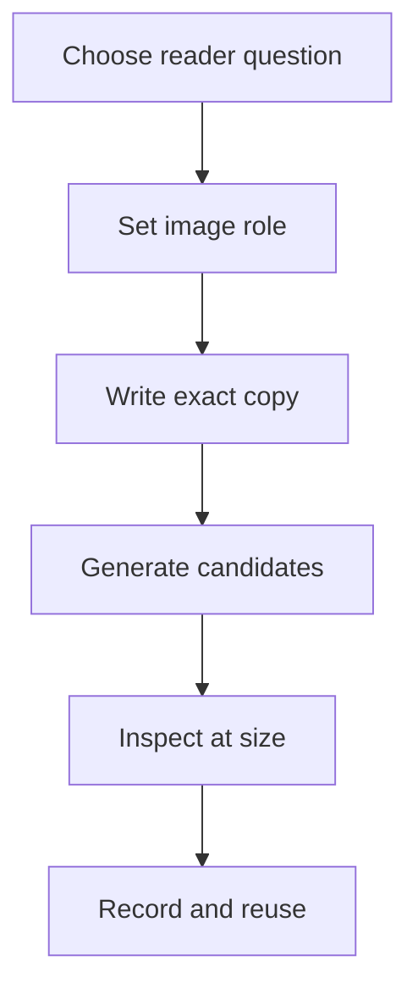

# Image generation and use

The README uses two accepted editorial illustrations. They clarify the reader's evidence-tracing task and the distinction between untrusted sources and JEV judgments.

## Reuse workflow

For every new or replacement image:

1. Name the reader question and choose a single visual idea.
2. Set the role, audience, orientation, dimensions, and crop behavior.
3. Supply the exact title and subtitle in the prompt record.
4. Generate candidates with the built-in image_gen workflow and inspect the actual result at its README size.
5. Reject missing or garbled copy, invented metrics, hidden subjects, and implications that exceed project evidence.
6. Record final alt text, review decision, source prompt record, and SHA-256 in the asset manifest.

## Current images

| File | Role and placement | Copy and accessible description | Crop and reuse |
| --- | --- | --- | --- |
| assets/marketing/trace-each-claim.jpg | Wide README lead | “Trace each claim” / “From scattered sources to reviewable evidence.” Alt: a researcher reads a paper at a desk while an ochre line connects a highlighted sentence across loose pages to a small evidence card. | Keep the full title block and the person in frame; use at full width on narrow screens. |
| assets/marketing/keep-model-roles-clear.jpg | Square visual in the workflow section | “Keep model roles clear” / “Grok provides sources; JEV supplies structured judgments.” Alt: a researcher compares a highlighted passage with a separate claim card connected by a restrained gold line. | Keep the heading and shoulder visible; stack at full width without cropping. |

The subtitle describes the intended role boundary. It does not assert that live source capture is integrated with JEV classification. Review the [.content-system asset manifest](../.content-system/asset-manifest.json) and [prompt records](../assets/marketing/IMAGE_NOTES.md) before replacing either image.

## Reproduction caveat

The original generator prompts were not retained with these files. The linked prompt records are explicitly reconstructed prompt intent, not verbatim prompts. Preserve that distinction if the images are regenerated.
