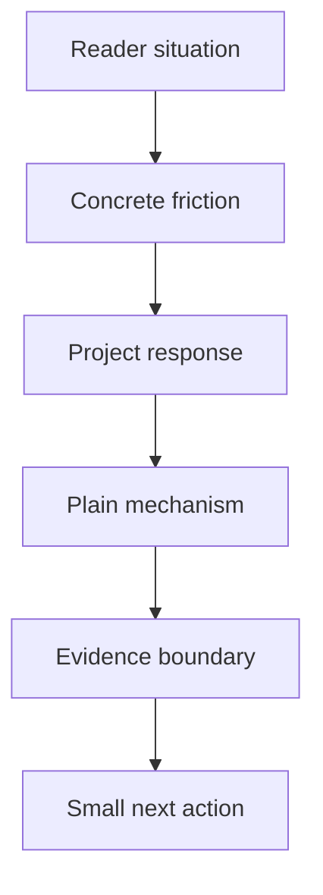

# README playbook

Use this process when the project story or evidence changes. Read the target repository first; the content helper supplies structure, not product facts.

## Story path

The adjacent prose should make the same sequence clear:

1. Name the reader and recognizable task.
2. Show the actual cost of the current problem.
3. Explain the bounded thing this repository does today.
4. Describe the mechanism in everyday language.
5. Link evidence and state what it does not prove.
6. Give a next step for readers and a separate reproduce path for maintainers.

## Build a source map before drafting

1. Read AGENTS.md, PROJECT.md, docs/CURRENT.md, and the owning issue.
2. Inspect the relevant implementation, tests, fixtures, and current source revision.
3. Record each material claim as shipped, experimentally supported, planned, or unknown.
4. For each claim, write what the source supports and what it does not establish.
5. Draft the project brief before polishing prose.
6. Review headings, evidence links, imagery, and next action.

## Example rule

Use the repository's synthetic fixture to explain one-fragment and mocked multi-source behavior. Say that the fixture is synthetic next to the example. Never turn a fixture into an accuracy result.

## Scan and link review

Read only the section headings, first sentences, bold anchors, and link text. The outline should still explain the reader's problem, current promise, mechanism, boundary, and next action. The local checker verifies headings, reference files, image links, and relative README links. It cannot review whether the prose is true or helpful.

Before publishing, complete [README_REVIEW.md](README_REVIEW.md). A citation gives a route to evidence; a human still decides whether the wording matches it.
