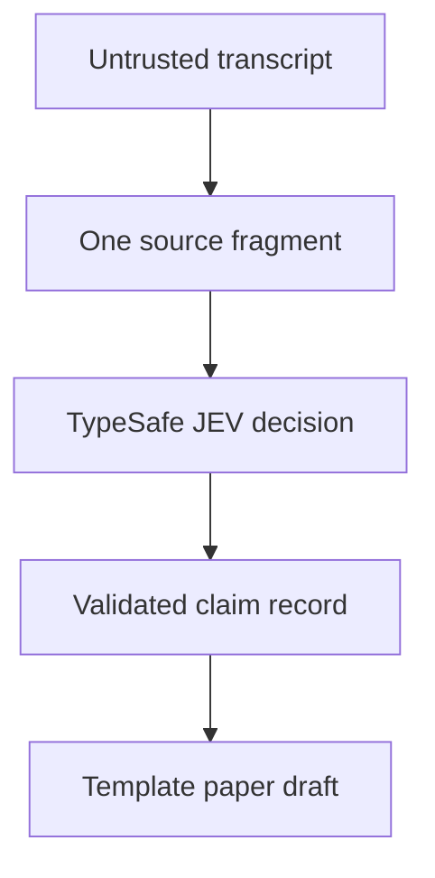

# System design for the README

The page uses the target repository's technical path at reader height:

Adjacent contract summary:

| Step | Current component | Boundary |
| --- | --- | --- |
| Capture | Grok/OpenRouter source module | Transcript and citations remain untrusted. |
| Select | Caller provides one fragment and closed options | No automatic multi-transcript reduction. |
| Judge | TypeSafe JEV Decisions | No other model may provide semantic classifier labels. |
| Record | Python normalization and claim builder | Timestamp, reference, and surfaced-model checks remain incomplete. |
| Render | Python paper assembler | Six-section draft only; no narrative synthesis or citation verification. |

The flow description is drawn from src/jev_classifier/sources/grok.py, src/jev_classifier/classify.py, src/jev_classifier/normalize.py, and src/jev_classifier/paper/assemble.py. The detailed module contract is owned by docs/SYSTEM_SPEC.md and its tracking issue; this README task does not change that contract.
